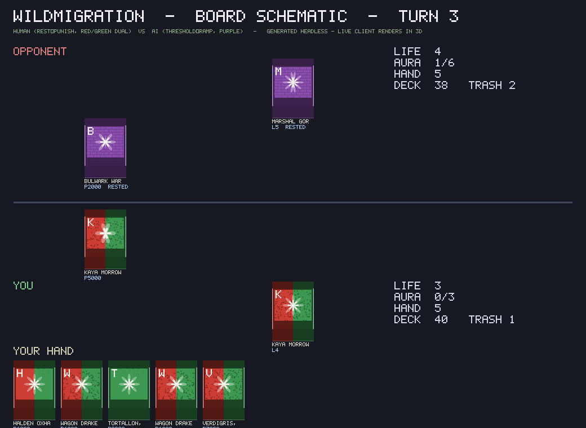

# WILDMIGRATION — Client (Phase 3) Screens & Run Notes

A playable human-vs-AI 3D client on top of the **frozen** Set 1 engine. The
client is a pure consumer of the engine: it drives the same public API the AI
policies use and renders by translating the engine's public `state.log` into
presentation beats. No rules live in `client/`.

---

## Board capture



> **Why a schematic and not a framebuffer grab?** This repo runs under
> `godot --headless`, whose dummy video driver cannot render a 3D framebuffer to
> disk. The capture above is generated *from the same Image tools the live client
> renders with* — now using `PlaceholderArt` (the new deterministic per-id card
> identity) — by playing a real scripted game to a mid-game state and drawing the
> resulting **public** board. On a machine with a GPU the identical state is drawn
> in 3D: creature billboards on an angled, lit table, real-font card frames, the
> aura rack, zone plaques. Regenerate it any time with:
>
> ```bash
> godot --headless -s tools/gen_screens.gd     # -> docs/screens/board_schematic.png
> ```

The capture (human = **Kaya, red/green dual**) shows both seats: each Vanguard,
the Banner row, the Stage slot, the Life / Aura / Hand / Deck / Trash counts, and
the human hand. Note that **every card has a distinct colour + sigil + initial**,
with its name and power/life printed — no two cards look alike. **Dual-colour
cards render a 50/50 vertical split** (Kaya's red/green cards are red on the left,
green on the right — never a blended colour), while mono cards (the purple
opponent) stay solid. The two example cards (Stormfoal, Cull-Beast) keep their
real art.

> **Headless caveat for reviewers.** The schematic is a faithful 2D projection of
> public state, but it is **not** the 3D scene. The camera framing, lighting,
> shadows, glow/vignette, table material, Label3D card text, and the hover
> **Card Inspector** only exist on a real GPU. That is exactly why the acceptance
> gate for this pass is the **Human Checklist** below, run on Tony's machine.

---

## Running the client

```bash
# Real GPU (desktop): launches the main menu -> table -> win/loss flow.
godot                      # main scene is client/main.tscn
```

**Main menu** — pick your Vanguard (all 8) and your opponent's Vanguard (or
*Random*). The AI automatically pilots its Vanguard with the matching archetype
(rush / rest_punish / refresh_tempo / lockdown / filter_control / discount_deploy
/ drain / threshold_ramp).

**On the table (mouse only):**

| Action | Input |
| --- | --- |
| **Read any card** | **Hover ~0.3s → Card Inspector (right side); click a card to pin it; Esc to close** |
| Play a card | Click a lit hand card (auto-slots; dimmed = unaffordable/no slot) |
| Pick an attacker | Click one of your units (a green ring appears) |
| Attack | Click a highlighted (red-ring) enemy unit / Vanguard |
| Attach Aura to an attack | `Aura +` / `Aura -` while an attacker is selected |
| Activate an ability | `Activate VG` / `Activate Stage` |
| Speed / skip animations | `Speed 1x↔2x`, `Skip` |
| Brightness (per-monitor) | menu slider, or `Dim` / `Bright` in-match |
| End your turn | `End Turn` |

The **Card Inspector** shows the full card: name, cost, colours, tribe,
keywords, complete effect text (synthesised from the structured data by
`CardText`), and flavour. It works **during prompts too**, so you can hover the
attacking creature while deciding whether to spend counters. Whenever an action
is illegal, the reason (e.g. *"can't attack: exhausted"*) floats **at the card**,
not only in the corner status banner.

**Prompts** appear as center panels when it's your decision:
- **Mulligan** — keep your opening hand or redraw once.
- **Defence** — when the AI attacks you: block with a Blocker, pitch counter
  cards, or take it.
- **Life trigger** — when a hit flips one of your Life cards with a trigger:
  resolve it or add it to your hand.

The **speed toggle (1x / 2x / skip)** is wired from day one through the
`PresentationQueue`, which paces beats between the instant engine and the screen.

---

## The two fully-wired example cards

`assets/cards/wm01-008/` (**Stormfoal Hatchling**) and `assets/cards/wm01-046/`
(**Cull-Beast 01**) ship complete **four-channel** assets — `sprite.png`,
`attack.png`, `summon.wav`, `hit.wav`, `voice.wav`, a `manifest.json`, and a
shared `vfx.strike` scene (`client/present/vfx_burst.tscn`). They exercise the
whole **summon state machine** — `summon → idle → attack_windup → strike →
return → idle`, plus `damaged / ko / rested / frozen / bounce / refresh /
life_trigger_reveal` — each state firing sprite + SFX + VFX + (optional) voice
through the `AssetManifest`. Every other card falls back gracefully: a generated
placeholder sprite, a generated whoosh, no voice, no VFX — so **art drops into
`assets/cards/<id>/` with zero code changes.**

Placeholder assets are procedurally generated (free) by:

```bash
godot --headless -s tools/gen_client_assets.gd
```

---

## Smoke tests

Client smoke tests live alongside the engine suites in `tests/unit/` and run in
the same GUT pass (`test_client_smoke.gd`):

```bash
godot --headless -s addons/gut/gut_cmdln.gd -gdir=res://tests/unit -ginclude_subdirs=true -gexit
```

They verify, headless:
- the `AssetManifest` resolves all four channels for a wired card and falls back
  for an unknown one;
- `CardFrame` renders every card type;
- the `PresentationQueue` orders beats and skip-flushes them;
- the `SummonStateMachine` walks the full attack chain back to idle;
- the `MatchController` plays a complete human-vs-AI game to `game_over`;
- the full client stack (BoardView + Hud) plays **turn 1** — mulligan, play,
  attack, pass — driven through the board's own click handlers, with no errors.

**Brief 10 readability smoke** (`test_readability_smoke.gd`) additionally checks:
- `CardText` synthesises correct effect text (e.g. *"On Play (2 Aura): KO an
  enemy Banner with 5000 power or less"*) and spells out keywords;
- the **Card Inspector** binds a pinned card's data and live-swaps on hover;
- **placeholder art is deterministic** — same id → identical bytes, different ids
  → different art — and the creature-sprite fallback is the per-id sigil, **not**
  the shared magenta diamond, while the two real-art cards keep their art;
- **dual-colour cards render a 50/50 vertical split** (left = colour A, right =
  colour B, never a blend); mono cards stay solid; the split is deterministic and
  applies to the frame, the creature sprite, and the inspector band;
- *(addendum v2)* the **creature billboard scale is normalised to a slot's
  footprint** regardless of source resolution (no ~3-slot sprites), real art and
  placeholder render the **same size**, the **floating debug initial is gone**,
  the summon uses **non-positional audio** (audible past the pulled-back camera),
  and a **VFX flash spawns on summon** for every creature.

**Brief 12.1 layout smoke** (`test_layout_smoke.gd`) checks the window-scaling
hotfix headless: the project uses `canvas_items` / `expand` stretch (viewport +
UI fill the window), and the **menu controls stay inside the frame at 1152×648,
1280×720, 1920×1080 and 1600×900** with the win/loss screen centred — no absolute
pixel positions anywhere in the menu/win-loss code.

**Engine untouched:** all pre-existing engine tests still pass — the full suite
is **172/172 green** (144 engine + 28 client).

---

## Human Checklist — for Tony (the Definition of Done for Brief 10)

A human has eyes now, so the acceptance gate is you, on your machine (RTX 3050 /
1080p target). Launch with `godot` (main scene `client/main.tscn`), start a match,
and report **pass/fail per item**. Suggested opponent: **Neza (lockdown)** or
**Bram (refresh_tempo)** for a busy board.

| # | Check | Pass? |
|---|-------|:-----:|
| 1 | From your hand, hover **Ragnir, Thunder-Maned** and read its full effect text in the inspector without squinting ("On Play (2 Aura): KO an enemy Banner with 5000 power or less"). | ☐ |
| 2 | Read a **long card name** in full on the frame (it wraps / shrinks — nothing is cut off with "…"). | ☐ |
| 3 | **Identify every creature on the board without clicking** — colour + sigil + name make each one distinct (no field of identical diamonds). | ☐ |
| 4 | **Find both players' Aura totals in under a second** — the two racks (bright = refreshed, dim = exhausted, ice-blue = frozen) each show `AURA n/total`. | ☐ |
| 5 | Hover an enemy Banner **during a defence prompt** and read it while the prompt is still open (deciding counters). | ☐ |
| 6 | **Click a card to pin** the inspector, move the mouse away, confirm it stays; press **Esc** to close. | ☐ |
| 7 | Try to attack with a **rested/summoning-sick** unit and see the reason (*"can't attack: exhausted / summoning sick"*) float **at that unit**. | ☐ |
| 8 | Confirm the **turn banner** is large and colour-coded (green on your turn, red on the AI's). | ☐ |
| 9 | Confirm the board **reads as a lit place**: warm/cool lighting, soft shadows under creatures, carved slot inlays, dark-wood table, gentle vignette — legible first, moody second. | ☐ |
| 10 | Confirm each **creature billboard sits centred ABOVE its slot** (not offset to the side), and that **Stormfoal Hatchling / Cull-Beast 01 show their real art** while everything else shows its placeholder sigil. | ☐ |
| 11 | **Identify a dual-colour card's BOTH colours at hand scale without the inspector** — dual cards render a **50/50 vertical split** (left = colour A, right = colour B, never a blend); a mono card stays solid. Try a red/green Kaya/Bram card next to a mono card. | ☐ |
| 12 | **Resize the window mid-menu AND mid-match** (incl. 1152×648, 1280×720, 1920×1080, maximized 1600×900) — nothing clipped or overlapping, the menu stays centred and fully visible, the inspector stays right-anchored, and the board fills the window with no large empty margins. | ☐ |
| 13 | *(verify-only)* **Every board zone is identifiable at default brightness in a normally lit room** — slots, inlays, aura racks and plaques read without leaning in. The brightness slider (menu) and Dim/Bright buttons (in-match) are a nice-to-have if your monitor needs it. | ☐ |
| 14 | **Framing (addendum v2):** the **full board + both Vanguard zones + the entire hand row** are visible at once with a small margin; the hand doesn't clip off the bottom at 1152×648; each **creature billboard sits within its slot's footprint** (no sprite spanning ~3 slots / occluding neighbours); and there are **no floating debug letters** on units (identity comes from the frame nameplate + colour/sigil). | ☐ |
| 15 | **CRITICAL — the four channels fire on hardware.** Summon **Stormfoal Hatchling** and **Cull-Beast 01**: you should **hear the summon SFX and voice line**, **see a VFX flash** over the creature, and the summon should **read as an event** (sprite scale-in + flash + sound over ~0.7s), not just a sprite popping in. Every other creature should at least flash + whoosh on summon. | ☐ |
| 16 | **Sprite scale consistency (finding 6):** the real-art creatures (Cull-Beast) render at the **same slot-relative size** as the placeholder-sigil creatures — neither noticeably smaller. | ☐ |

Bonus perf check: with a full board + several animations, does it stay smooth at
1080p on the 3050? Note any hitches (card-frame build, glow, shadows) so they can
be tuned.

> Reminder: items 1–2, 5–9, the split in 11, and the look in 12–16 are **only
> fully judged on a real GPU** — the headless CI proves the data, wiring and
> layout math are correct (172/172 tests, incl. the dual-split determinism and the
> menu-fits-the-frame layout smoke) but not that the pixels look right. That's
> this checklist's job.
